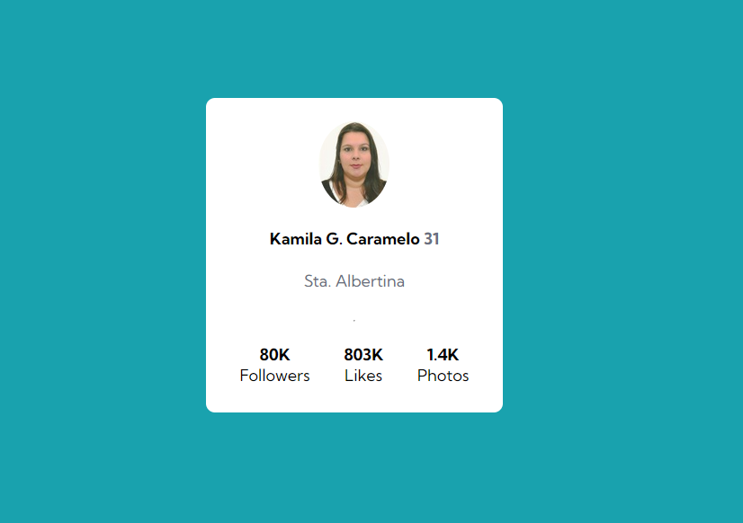
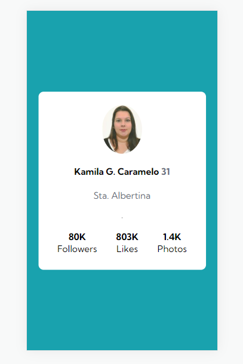

# Cartão de Perfil 

Este projeto foi desenvolvido como um desafio no módulo de CSS e HTML avançado, usando FLEXBOX.

## Desafio
A cada nova etapa do curso, uma descoberta, a cada passo um novo desafio. O que antes era um bicho de sete cabeças, hoje consigo visualizar de forma mais simplificada. 
Este desafio foi realizado em algumas horas, com uma certa dificuldade na parte de centralização, mas tirada de letra quando a persistencia é maior do que a desistencia. 

## Qual o projeto?
Fazer uma copia exata de um cartão de perfil que nos foi dado para desktop e mobile de forma responsiva. 

## Imagens do projeto executado
Imagem com resolução para telas maiores:

[>]

Imagem com resolução menor para telas menores de forma responsiva:
[>]

